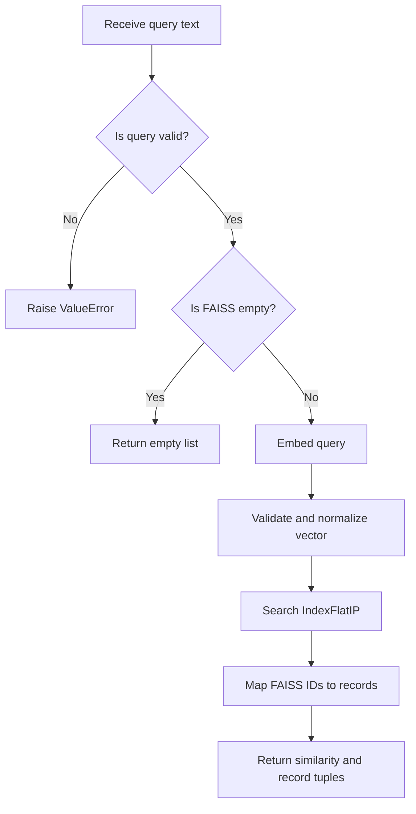
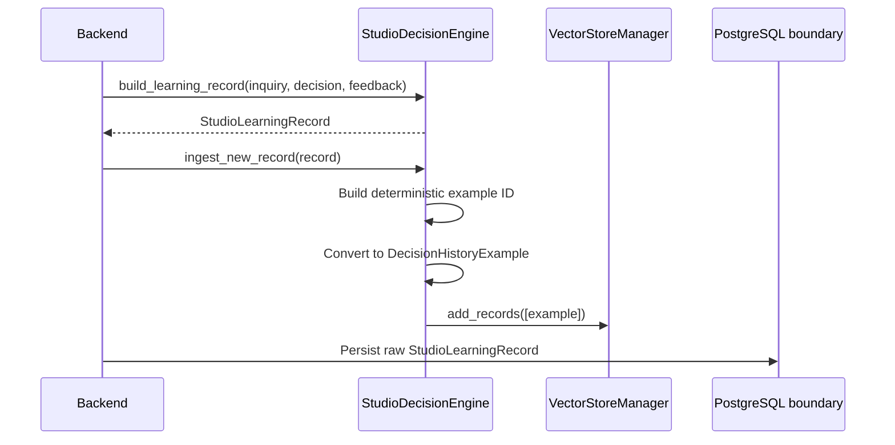

# INK Flow AI Vector Search and Learning Layer

## Why this layer exists

The learning layer gives INK Flow AI a practical way to reuse decisions that
studio staff have already reviewed.

The original decision engine can route an inquiry using fixed rules. For
example, it can map a fine-line request to Nina or a watercolor request to
Hoss. Those rules are useful, but they cannot represent every artist, studio
preference, or exception.

The learning layer adds verified studio history to that process. When staff
correct an artist assignment or approve a next action, the AI can turn that
feedback into a searchable example. Future inquiries retrieve the most similar
examples before making a recommendation.

This is retrieval-based learning. It does not fine-tune an OpenAI model and it
does not allow the language model to rewrite studio policy.

## An important distinction about the vector database

In this project, the term vector database refers to a local FAISS index.
FAISS is an efficient similarity-search library, not a remote database server.

The implementation divides responsibility like this:

| Responsibility | Owner |
| --- | --- |
| Create embeddings | OpenAI `text-embedding-3-small` |
| Store and search vectors | FAISS `IndexFlatIP` |
| Validate learning data | Pydantic v2 models |
| Save raw learning records | Backend and PostgreSQL |
| Save the local FAISS index | `VectorStoreManager` |
| Map FAISS IDs back to records | JSON metadata sidecar |
| Final artist and action scoring | `StudioDecisionEngine` |

PostgreSQL remains the source of truth for raw business records. The AI module
does not open a PostgreSQL connection. The backend developer can persist the
raw `StudioLearningRecord` and later supply verified examples to the AI layer.

## High-level architecture


The key design choice is that FAISS finds candidates, while deterministic code
makes the final business decision. Similarity search does not directly assign
an artist.

## Main implementation files

| File | Purpose |
| --- | --- |
| `ai_brain/vector_store.py` | Embeddings, FAISS indexing, search, save, load |
| `ai_brain/decision.py` | Retrieval, scoring, artist voting, record ingestion |
| `ai_brain/decision_schemas.py` | Strict learning and decision contracts |
| `ai_brain/pricing.py` | Staff-only deterministic price estimation |
| `tests/test_learning_layer.py` | Learning-layer unit and integration tests |
| `requirements.txt` | Pinned FAISS and NumPy dependencies |

## Data models used by the learning layer

### `StudioLearningRecord`

A `StudioLearningRecord` represents one completed feedback cycle. It contains:

- The inquiry channel.
- The original client message.
- Up to seven recent chat messages.
- Reference image URLs.
- The original `StudioDecisionOutput`.
- The final human feedback.

The schema supports image-only inquiries. It requires at least one of these:

- A non-empty client message.
- A reference image URL.

Reference URLs are trimmed and empty values are removed. Every schema inherits
from a strict Pydantic base model with `extra="forbid"`, so unexpected fields
are rejected instead of silently entering the learning system.

### `DecisionHistoryExample`

FAISS does not index the full raw learning record. The engine converts it into
a smaller `DecisionHistoryExample` containing the fields needed for retrieval
and decision support:

- Style tags.
- Placement.
- Size estimate.
- Color preference.
- Inquiry channel.
- Original AI artist and action.
- Final human-approved artist and action.
- Feedback outcome and correction reason.
- Optional approved price range.

This keeps the embedding text focused and avoids embedding chat history, phone
numbers, lead names, or other unrelated database state.

## How records become vectors

`decision_history_to_text()` converts each history example into one predictable
text representation.

Example:

```text
Tattoo styles: fine-line, floral. Placement: forearm.
Size in centimeters: 8 cm. Color preference: black-and-grey.
```

Using a stable format matters because indexed documents and new queries should
describe features in the same way.

The default embedding model is:

```text
text-embedding-3-small
```

The production embedding dimension is 1,536. The embedding client receives the
API key, timeout, and retry configuration from the existing application
settings. Tests inject a deterministic three-dimensional embedding model, so
they never contact OpenAI.

## Why the index uses `IndexFlatIP`

The manager normalizes every document and query vector to length 1. It then
stores the vectors in `faiss.IndexFlatIP`.

For normalized vectors, the inner product is cosine similarity:

```text
cosine_similarity(a, b) = dot(a, b) / (length(a) * length(b))

After normalization:

length(a) = 1
length(b) = 1

Therefore:

cosine_similarity(a, b) = dot(a, b)
```

This means a higher FAISS score represents a more similar case.

`IndexFlatIP` performs exact search. It does not approximate neighbors. That is
a good starting point for a learning set that is expected to be small or
medium in size.

## Adding records to FAISS

`VectorStoreManager.add_records()` performs these steps:

1. Return immediately when the input list is empty.
2. Convert every record into searchable text.
3. Call `embed_documents()` once for the batch.
4. Convert the response to a NumPy `float32` matrix.
5. Validate the vector count and expected dimension.
6. Reject non-finite values such as `NaN` or infinity.
7. Reject zero-length vectors.
8. Normalize vectors with `faiss.normalize_L2()`.
9. Add the matrix to FAISS.
10. Append the Pydantic records in the same order.

FAISS assigns integer positions to vectors. The record list uses the same
positions, which creates this mapping:

```text
FAISS vector 0 -> records[0]
FAISS vector 1 -> records[1]
FAISS vector 2 -> records[2]
```

The manager validates that the FAISS vector count always equals the record
count.

## Searching for similar cases

`search_similar_cases(query_text, top_k=5)` follows this flow:



The empty-index check happens before query embedding. This avoids an OpenAI API
call when there is nothing to search.

The method returns:

```python
list[tuple[float, DecisionHistoryExample]]
```

Each tuple contains the cosine-similarity score and its validated history
record. Results are ordered from highest similarity to lowest similarity.

If `top_k` is larger than the index, the manager searches only the number of
vectors that actually exist. Negative FAISS IDs are ignored, and an unmapped ID
raises an explicit runtime error.

## Saving and loading the index

FAISS stores vectors, but it does not know about Pydantic objects. Saving only
the binary index would lose the mapping between vector IDs and studio records.

`save_index("data/learning.faiss")` writes two files:

```text
data/learning.faiss
data/learning.faiss.records.json
```

The first file is the native FAISS binary. The JSON sidecar stores:

- Metadata schema version.
- Embedding model name.
- Embedding dimension.
- Ordered `DecisionHistoryExample` records.

`load_index()` validates all of the following before accepting persisted data:

- Both files exist.
- The JSON matches the strict Pydantic schema.
- The embedding model matches the current manager.
- The embedding dimension matches.
- The FAISS metric is inner product.
- The vector count matches the number of records.

The binary and sidecar must always be deployed, backed up, and restored
together.

## How vector search affects studio decisions

`StudioDecisionEngine` accepts an optional injected `VectorStoreManager`.
Dependency injection keeps the engine testable and prevents it from owning
database or application startup concerns.

During `decide()` the engine:

1. Builds a query from the current style, placement, size, and color.
2. Requests up to 12 candidates from FAISS.
3. Falls back to request-scoped `decision_history` if no vector store or no
   vector result is available.
4. Removes duplicate example IDs.
5. Applies the existing deterministic score to each candidate.
6. Discards candidates with a structured score below 3.
7. Uses the resulting evidence for artist and next-action voting.

FAISS order is used as a tie-breaker when structured scores are equal.

## Deterministic scoring after retrieval

Vector similarity finds semantically relevant candidates. The following
structured score decides whether each candidate is reliable enough to use:

| Match | Score |
| --- | ---: |
| Each overlapping style tag | +4 |
| Exact placement match | +2 |
| Same inquiry channel | +1 |
| Exact color match | +1 |
| Size difference at most 2 cm | +2 |
| Size difference at most 5 cm | +1 |

If neither style nor placement matches, the score is immediately 0. A candidate
must score at least 3 to participate in routing.

This hybrid approach is safer than trusting cosine similarity alone. A record
can sound similar while still being wrong for the current placement or style.

## Artist suggestion logic

Each trusted historical example votes for its final human-approved artist. The
vote weight is the deterministic structured score.

The engine then:

- Selects the artist with the highest total score.
- Rejects an unresolved tie.
- Confirms that the artist exists in the current request's artist catalog.
- Reports `verified_history` as the source.
- Uses high confidence when the score is at least 8 or multiple examples
  support the same artist.

If verified history is not decisive, the engine falls back to its original
rule-based artist routing.

This design allows a request-scoped artist such as Lana to be learned even
though the original extraction contract only knows Nina, Hoss, and Unclear.

## Next-action suggestion logic

Historical final actions also receive weighted votes, but safety rules still
have priority:

1. A direct pricing question produces `pricing_review`.
2. A matched pricing rule requiring consultation produces
   `offer_consultation`.
3. Otherwise, verified historical actions may vote on the next action.
4. If history is inconclusive, the engine uses its conservative default rules.

The default rules still consider high risk, missing information, unclear
artist assignment, and booking readiness.

Vector history currently informs artist and action suggestions. Staff-only
price estimation continues to use explicit pricing rules and approved history
inside `StudioDecisionContext`.

## Creating and ingesting a new learning record

Learning begins only after a human has reviewed the decision.



`build_learning_record()` keeps the latest seven chat messages and validates
that a final artist belongs to the supplied artist catalog.

`build_history_example()` copies the extracted tattoo features and human
outcome into a `DecisionHistoryExample`.

`ingest_new_record()` creates a stable identifier by hashing the serialized
Pydantic record with SHA-256 and keeping the first 24 hexadecimal characters:

```text
learning-<24-character-record-hash>
```

The stable ID gives the backend a useful key for idempotent persistence. The
method then adds the converted example to FAISS.

The code contains the explicit PostgreSQL integration placeholder:

```python
# Backend developer will persist the raw record to PostgreSQL here.
```

No PostgreSQL driver or connection logic is included in the AI module.

## Wiring the learning layer into the application

The vector store is optional. Existing callers can continue using static
request-scoped history. To enable FAISS retrieval, the application composition
layer must inject the manager into the decision engine.

```python
from ai_brain.decision import StudioDecisionEngine
from ai_brain.processor import StudioAIBrain
from ai_brain.vector_store import VectorStoreManager

vector_store = VectorStoreManager()
vector_store.load_index("data/learning.faiss")

decision_engine = StudioDecisionEngine(vector_store=vector_store)
brain = StudioAIBrain(decision_engine=decision_engine)
```

For the first startup, when no index file exists, the backend can retrieve
verified records from PostgreSQL, convert them into history examples, and call
`vector_store.add_records(examples)`. It can then save the built index.

The default `StudioAIBrain()` currently creates a decision engine without a
vector store. This is intentional because index location, lifecycle, and
PostgreSQL hydration belong to the application or backend composition layer.

## Testing strategy

`tests/test_learning_layer.py` uses dependency injection to avoid external API
calls. `DummyEmbeddings` maps the test styles to predictable unit vectors:

```text
fine-line  -> [1, 0, 0]
watercolor -> [0, 1, 0]
traditional -> [0, 0, 1]
```

The tests verify:

1. Fine-line search returns the fine-line case first.
2. An empty index does not call the embedding provider.
3. Saving and loading preserves vectors and Pydantic records.
4. `StudioDecisionEngine` uses retrieved feedback to select the verified
   artist.

The complete project suite contains 57 passing tests. The learning tests do not
use an OpenAI API key or make network requests.

## Dependencies and commands

The learning layer adds these pinned runtime dependencies:

```text
faiss-cpu==1.15.0
numpy==2.5.2
```

Install all development dependencies:

```powershell
python -m pip install -r requirements-dev.txt
```

Run the full test suite:

```powershell
python -m pytest -q -p no:cacheprovider
```

Start the API:

```powershell
python -m uvicorn api.main:app --host 127.0.0.1 --port 8001
```

## Current limitations

The current implementation is intentionally focused, but these boundaries are
important:

- `IndexFlatIP` keeps every vector in memory and performs exact search.
- Record deletion and vector updates are not implemented yet.
- Duplicate example IDs are removed during decision retrieval, but duplicate
  vectors can still occupy index space if the same record is ingested twice.
- Raw `StudioLearningRecord` persistence remains a backend responsibility.
- The backend must coordinate PostgreSQL commits and FAISS index updates.
- The FAISS binary and JSON sidecar are a pair and cannot be separated.
- Rebuilding or swapping the index during live traffic is not automated.
- Embedding-model or dimension changes require a complete index rebuild.
- The default API composition does not automatically load a FAISS index.

## Summary

The INK Flow AI learning layer combines three kinds of intelligence:

1. OpenAI embeddings understand semantic similarity between tattoo requests.
2. FAISS retrieves relevant studio-approved history efficiently.
3. Deterministic scoring protects artist routing and next-action decisions.

This gives the project a useful learning loop without hiding business policy
inside a language model. Human feedback remains the trusted source, PostgreSQL
remains the durable source of truth, and FAISS acts as the fast retrieval layer
for future decisions.
